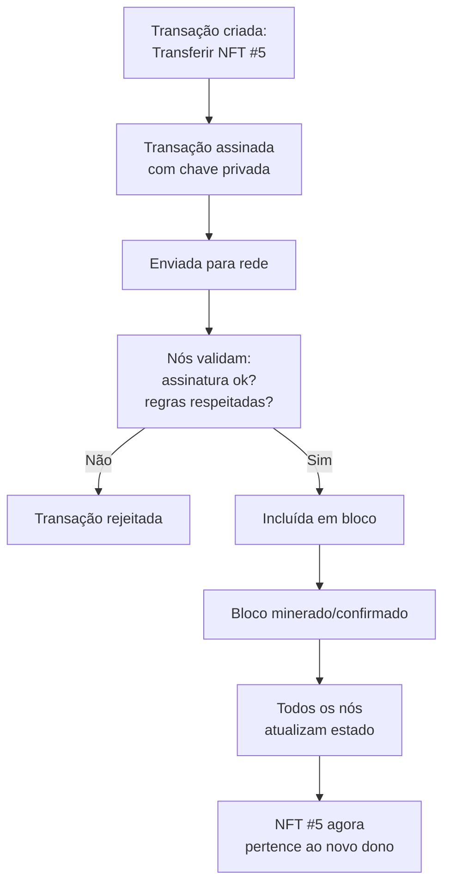
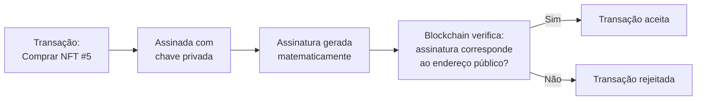
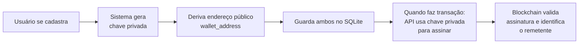
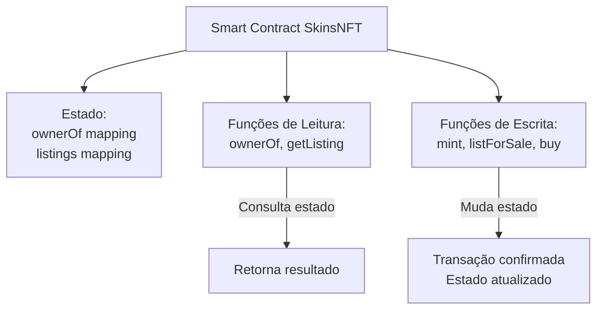
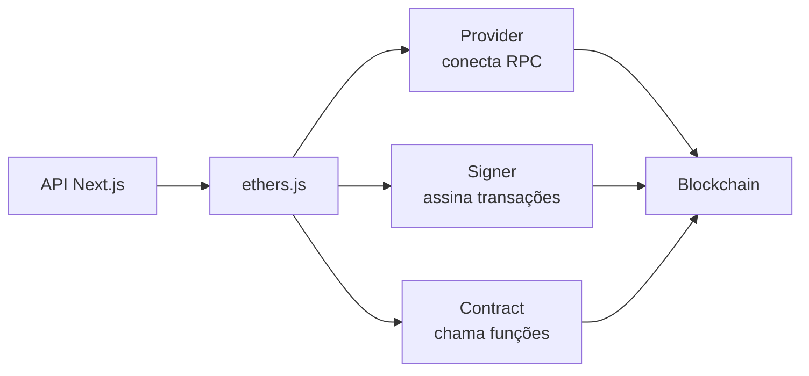
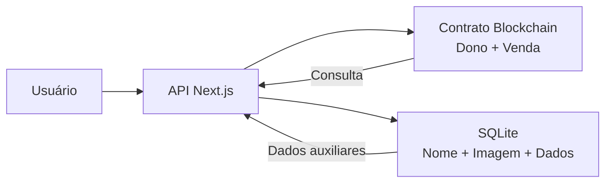
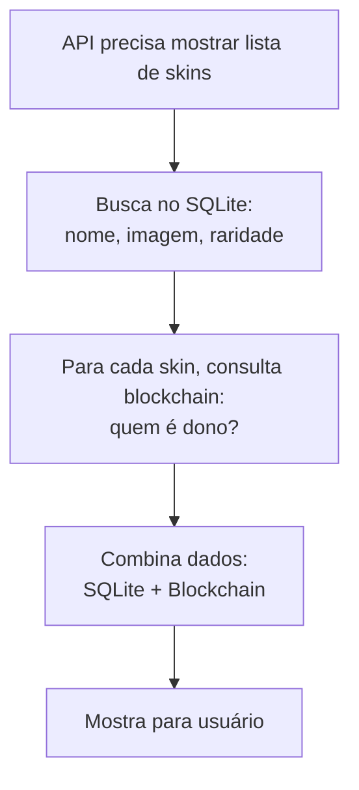
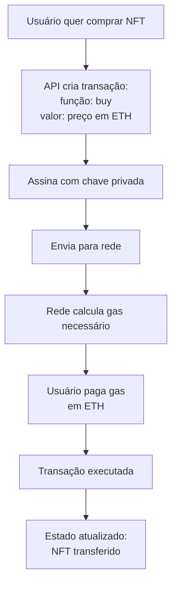
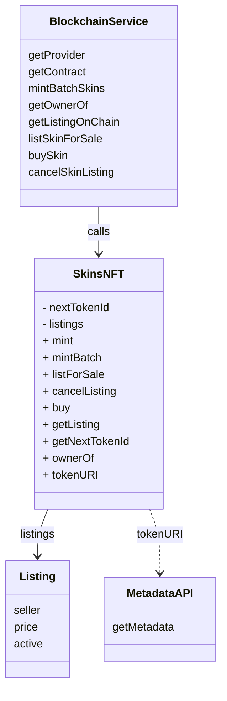

# Relatório de entrega (Blockchain) — SkinsNFT

Este relatório explica como funciona a parte de blockchain do projeto SkinsNFT, focando em como ocorrem as operações de compra e venda de NFTs.

## O que é blockchain (explicação prática)

Blockchain é uma forma de manter um "livro-razão" (ledger) compartilhado onde várias pessoas ou computadores mantêm cópias idênticas do mesmo registro. A diferença para um banco de dados comum é que não existe um "dono" central que pode alterar os dados quando quiser.

**Como funciona na prática:**

Imagine um caderno que várias pessoas têm uma cópia. Quando alguém quer fazer uma mudança (por exemplo, "João agora é dono do token #5"), essa pessoa escreve uma mensagem, assina com sua assinatura única, e envia para todos. Todos verificam se a assinatura é válida e se a mudança faz sentido. Se a maioria concordar, todos atualizam suas cópias do caderno.

Na blockchain real:
- O "caderno" é uma sequência de blocos, cada um contendo várias transações
- Cada bloco referencia o anterior (formando uma "corrente" - chain)
- Múltiplos computadores (nós) mantêm cópias idênticas
- Quando uma transação é incluída em um bloco, ela vira parte permanente do histórico



**Estado vs. Transações:**

A blockchain mantém dois tipos de informação:

1. **Estado atual**: quem é dono de cada NFT agora, quais estão à venda, etc. É como uma "foto" do momento atual.
2. **Histórico de transações**: todas as mudanças que aconteceram. É como um "filme" de tudo que já ocorreu.

Quando você consulta `ownerOf(tokenId)`, está lendo o estado atual. Quando você faz uma transação de compra, está criando uma nova entrada no histórico que vai mudar o estado.

## Chaves privadas e públicas: como funciona a autenticação

Na blockchain, não existe "login com senha". Em vez disso, cada pessoa tem um par de chaves:

- **Chave privada**: é como uma senha super secreta que nunca deve ser compartilhada. Quem tem a chave privada controla a conta. É uma string longa de números e letras (exemplo: `0xac0974bec39a17e36ba4a6b4d238ff944bacb478cbed5efcae784d7bf4f2ff80`).
- **Endereço público (wallet_address)**: é derivado da chave privada usando matemática criptográfica. É como um "número de conta" que todo mundo pode ver (exemplo: `0xf39Fd6e51aad88F6F4ce6aB8827279cffFb92266`).

**Como funciona a assinatura:**

Quando você quer fazer uma transação, você "assina" ela com sua chave privada. A assinatura é uma prova matemática de que você tem a chave privada, sem precisar revelar a chave. É como assinar um documento: qualquer um pode verificar que a assinatura é sua, mas ninguém consegue falsificar.



**No projeto SkinsNFT:**

Quando um usuário se cadastra, o sistema gera automaticamente um par de chaves para ele:
- A chave privada é guardada no SQLite (na tabela `users`, coluna `wallet_private_key`)
- O endereço público é guardado também (coluna `wallet_address`)

Quando o usuário quer fazer uma transação (vender ou comprar), a API pega a chave privada dele do banco e usa para "assinar" a transação. A blockchain verifica a assinatura e identifica quem está fazendo a operação.



## Smart Contracts: programas que rodam na blockchain

Um smart contract é como um programa de computador que roda na blockchain. A diferença é que ele não roda em um único servidor, mas sim em todos os nós da rede simultaneamente.

**Características importantes:**

1. **Determinístico**: dado o mesmo estado inicial e a mesma transação, todos os nós chegam ao mesmo resultado. Isso garante que todos concordem sobre o estado.

2. **Imutável**: uma vez deployado, o código do contrato não pode ser alterado. Se houver um bug, precisa fazer deploy de um novo contrato.

3. **Público**: qualquer um pode ler o código do contrato e ver o que ele faz. Não há "código secreto".

4. **Armazenamento persistente**: o contrato pode guardar dados permanentemente na blockchain (como quem é dono de cada NFT).

**Como o contrato guarda dados:**

O contrato usa estruturas chamadas "mappings" (mapeamentos) que funcionam como dicionários:

- `mapping(uint256 => address) private _owners` → para cada tokenId, guarda o endereço do dono
- `mapping(uint256 => Listing) public listings` → para cada tokenId, guarda se está à venda e qual o preço

É como se fosse uma tabela onde você pode consultar "quem é dono do token #5?" ou "o token #5 está à venda? Qual o preço?".

**No projeto SkinsNFT:**

O contrato `SkinsNFT.sol` tem funções que podem ser chamadas:

- **Funções de leitura** (não mudam estado, não custam gas do usuário):
  - `ownerOf(tokenId)` → retorna quem é dono
  - `getListing(tokenId)` → retorna se está à venda e qual o preço
  
- **Funções de escrita** (mudam estado, custam gas):
  - `mintBatch()` → cria novos NFTs (só admin pode)
  - `listForSale()` → coloca NFT à venda
  - `buy()` → compra NFT e transfere propriedade
  - `cancelListing()` → cancela uma venda

**Exemplo prático: como funciona o `buy()`:**

Quando alguém chama `buy(tokenId)` enviando ETH:

1. O contrato verifica se o token está à venda (`require(listing.active)`)
2. Verifica se o valor enviado é suficiente (`require(msg.value >= listing.price)`)
3. Verifica se o vendedor ainda é dono (`require(ownerOf(tokenId) == listing.seller)`)
4. Se tudo estiver ok:
   - Marca a listing como inativa (`listing.active = false`)
   - Transfere o NFT (`_transfer(seller, msg.sender, tokenId)`)
   - Envia o ETH para o vendedor (`payable(seller).call{value: price}("")`)

Se qualquer um dos `require()` falhar, a transação inteira é revertida e nada muda.



**Importante:** A chave privada é muito sensível. Se alguém conseguir a chave privada de um usuário, pode fazer transações em nome dele. Por isso, em produção, as chaves não deveriam ficar no servidor; o ideal é que o usuário assine no próprio navegador (usando MetaMask, por exemplo).

## Como o projeto se conecta à blockchain

Para interagir com a blockchain, o projeto usa a biblioteca **ethers.js**, que funciona como um "tradutor" entre JavaScript e a blockchain.

**RPC (Remote Procedure Call):**

A conexão acontece através de um nó RPC, que é como um "servidor" que fala a linguagem da blockchain. No projeto, isso é configurado via variável de ambiente `RPC_URL`. Pode ser:
- Um nó local do Hardhat (para desenvolvimento)
- Um nó público da Sepolia (rede de teste)
- Um nó da rede principal Ethereum (em produção)

**O que o ethers.js faz:**

1. **Provider**: conecta ao nó RPC e permite ler o estado da blockchain
2. **Signer**: usa a chave privada para assinar transações antes de enviar
3. **Contract**: cria uma interface JavaScript para chamar funções do contrato



**Exemplo prático:**

Quando a API quer saber quem é dono de um NFT:

```javascript
const contract = getContract(provider);  // Conecta ao contrato
const owner = await contract.ownerOf(tokenId);  // Chama função de leitura
```

Quando a API quer fazer uma compra:

```javascript
const signer = getUserSigner(privateKey);  // Cria signer com chave privada
const contract = getContract(signer);  // Conecta com signer (pode escrever)
const tx = await contract.buy(tokenId, { value: priceWei });  // Envia transação
await tx.wait();  // Espera confirmação
```

## Arquitetura geral: o que cada parte faz

O sistema tem três componentes principais:

**1. Contrato na blockchain (SkinsNFT.sol)**
É a "fonte da verdade". Guarda quem é dono de cada NFT e quais estão à venda. Essa informação não pode ser alterada sem uma transação válida assinada.

**2. Banco SQLite**
É um banco de dados local que guarda informações auxiliares: nome da skin, raridade, imagem SVG e metadados. Também guarda dados de usuários e sessões de login. O objetivo é acelerar a interface e evitar consultas desnecessárias à blockchain. Importante: o SQLite não decide quem é dono; isso só a blockchain decide.

**3. API (Next.js)**
Conecta o frontend com a blockchain e o banco. Quando precisa saber quem é dono, consulta a blockchain. Quando precisa mostrar nome/imagem, consulta o SQLite.



## Como funciona: colocar uma skin à venda

**Passo a passo:**

1. Usuário informa o tokenId e o preço em ETH.
2. API consulta a blockchain: "quem é dono deste token?" (`ownerOf(tokenId)`).
3. Se o usuário for o dono, a API assina uma transação com a chave privada do usuário.
4. A transação é enviada para a blockchain.
5. O contrato verifica novamente se quem está chamando é o dono.
6. Se tudo estiver ok, o contrato grava que aquele token está à venda, com o preço informado.
7. A partir desse momento, qualquer pessoa pode consultar e ver que a skin está à venda.

## Como funciona: comprar uma skin

**Passo a passo:**

1. Comprador clica em "Comprar" na skin desejada.
2. API consulta a blockchain para ver se está à venda e qual o preço (`getListing(tokenId)`).
3. API verifica se o comprador tem ETH suficiente na carteira.
4. Se tiver, a API assina uma transação com a chave do comprador, incluindo o pagamento em ETH.
5. A transação é enviada para a blockchain.
6. O contrato valida: a listing está ativa? O valor enviado é suficiente? O vendedor ainda é dono?
7. Se tudo estiver ok, o contrato faz três coisas **na mesma transação**:
   - Transfere o NFT do vendedor para o comprador
   - Envia o ETH do comprador para o vendedor
   - Marca a listing como vendida
8. Se qualquer coisa falhar, a transação inteira é revertida (nada muda).
9. Após confirmação, o comprador é o novo dono e pode consultar isso na blockchain.

## O papel do SQLite (banco de dados local)

O SQLite serve para duas coisas principais:

**1. Cache de informações que não mudam na blockchain**
Nome da skin, raridade, imagem SVG e atributos são gerados uma vez e não mudam. Guardar isso no SQLite evita ter que consultar a blockchain toda vez que alguém quer ver a lista de skins. Quando a API precisa mostrar a lista, ela busca no SQLite (rápido) e depois consulta a blockchain só para saber quem é dono de cada uma.

**2. Dados de usuários e autenticação**
O SQLite guarda emails, senhas (hash), endereços de carteira e sessões de login. Isso é necessário porque a blockchain não tem conceito de "usuário" ou "login"; ela só conhece endereços de carteira.

**Importante:** O SQLite nunca decide quem é dono de um NFT. Se o SQLite diz que o usuário X é dono, mas a blockchain diz que é Y, a verdade é Y (blockchain sempre ganha).



## Transações: como funcionam na prática

Uma transação na blockchain é como uma "ordem de serviço" que você envia para a rede. Ela contém:

1. **De quem vem** (from): seu endereço público
2. **Para onde vai** (to): endereço do contrato ou outro usuário
3. **O que fazer**: qual função do contrato chamar e com quais parâmetros
4. **Quanto pagar**: valor em ETH (se for uma compra, por exemplo)
5. **Assinatura**: prova criptográfica de que você tem a chave privada

**Gas e custos:**

Toda transação que muda o estado da blockchain custa "gas". Gas é como uma taxa de processamento. Quanto mais complexa a operação, mais gas ela consome. O gas é pago em ETH.

Por exemplo:
- Consultar `ownerOf()` → não custa gas (só leitura)
- Fazer `buy()` → custa gas (muda estado, transfere NFT e ETH)



**Nonce: evitando duplicação**

Cada conta tem um "nonce" (número usado uma vez) que aumenta a cada transação. Isso garante que:
- Transações sejam executadas na ordem correta
- Não seja possível reutilizar a mesma transação duas vezes
- Se você enviar duas transações rapidamente, elas sejam processadas sequencialmente

No projeto, quando fazemos muitas transações seguidas (como ao fazer seed de muitos NFTs), precisamos gerenciar o nonce corretamente para evitar erros.

## Segurança: o que a blockchain garante

A blockchain garante que:

- **Propriedade é verificável**: qualquer pessoa pode consultar `ownerOf(tokenId)` e saber quem é o dono real, sem depender de confiar em um servidor. Não há como falsificar isso porque o estado está replicado em milhares de nós.

- **Vendas são atômicas**: quando alguém compra, o pagamento e a transferência acontecem juntos na mesma transação. Não existe situação de "pagou mas não recebeu" ou "recebeu mas não pagou". Se qualquer parte falhar, tudo é revertido.

- **Apenas o dono pode vender**: o contrato verifica criptograficamente (via assinatura) se quem está tentando listar é realmente o dono. Mesmo que alguém consiga acesso ao servidor, não consegue falsificar a assinatura sem a chave privada.

- **Histórico imutável**: uma vez que uma transação é confirmada em um bloco, ela vira parte permanente do histórico. Não há como "desfazer" ou alterar transações passadas.

**Limitações deste MVP:**

- Chaves privadas são guardadas no servidor (adequado para demo local, mas em produção deveriam ficar no cliente com MetaMask).
- Metadata está em servidor local (em produção deveria estar em IPFS/Arweave para ser imutável e descentralizado).

## Diagrama de classes


